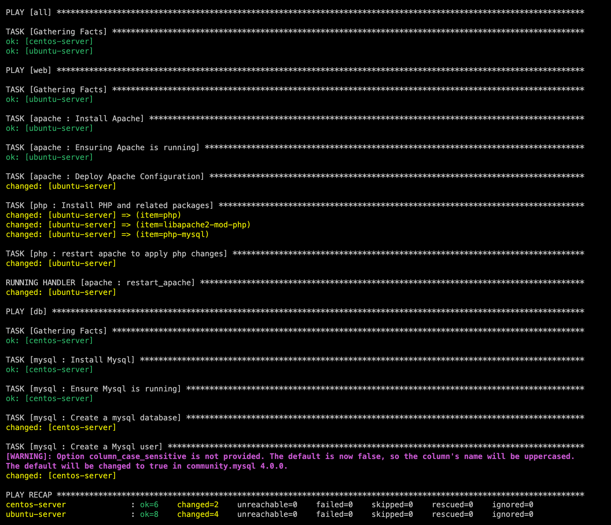

# Ansible LAMP Stack Deployment

## Project Overview

This project demonstrates the use of Ansible to automate the deployment of a LAMP (Linux, Apache, MySQL, PHP) stack across multiple servers. The project is set up in a distributed architecture where:
- **Ubuntu** is used as the web server running Apache and PHP.
- **Amazon Linux 2023** (CentOS-like) is used as the database server running MariaDB (MySQL).

The automation is done using **Ansible Playbooks** with roles for installing and configuring Apache, PHP, MySQL, security hardening, and firewall setup.

## Prerequisites

### Systems:
- 1 x Ubuntu Server (for Apache and PHP)
- 1 x Amazon Linux 2023 Server (for MariaDB)

### Tools:
- Ansible installed on the control machine (Ubuntu/Linux)
- SSH key-based authentication between the control machine and target servers

### Ansible Version:
- Ansible 2.9+
  
### Python Dependencies:
- PyMySQL for MySQL management on Amazon Linux 2023

## Project Structure

```
.
│
├── inventory/
│   └── hosts.yml                # Inventory file with target hosts and groups
├── playbooks/
│   └── site.yml                 # Main playbook to orchestrate LAMP stack deployment
├── roles/
│   ├── apache/                  # Apache installation and configuration
│   │   ├── tasks/
│   │   ├── handlers/
│   │   └── templates/
│   ├── php/                     # PHP installation and configuration
│   ├── mysql/                   # MySQL installation and configuration on Amazon Linux
│   ├── firewall/                # UFW and Firewalld configuration
│   └── ssh_hardening/           # SSH security hardening
└── screenshots/                 # Directory for project screenshots

```

### Inventory Configuration

The inventory file (`inventory/hosts.yml`) defines the servers where the roles will be applied.

```yaml
all:
  hosts:
    ubuntu-server:
      ansible_user: ubuntu
      ansible_host: <your_ubuntu_server_ip>
      ansible_ssh_private_key_file: ./ansible-servers
    centos-server:
      ansible_user: ec2-user
      ansible_host: <your_amazon_linux_server_ip>
      ansible_ssh_private_key_file: ./ansible-servers
      ansible_python_interpreter: /usr/bin/python3
```

#### Key Tasks:
- Configure UFW on Ubuntu (`ufw`)
- Configure `firewalld` on Amazon Linux (`firewalld`)

### 5. **SSH Hardening Role (Both Servers)**
This role hardens SSH on both servers by disabling password-based authentication and allowing only key-based authentication.

#### Key Tasks:
- Disable password-based SSH login (`lineinfile`)
- Restart SSH service (`service`)

## Screenshots

### Ansible Playbook Execution



